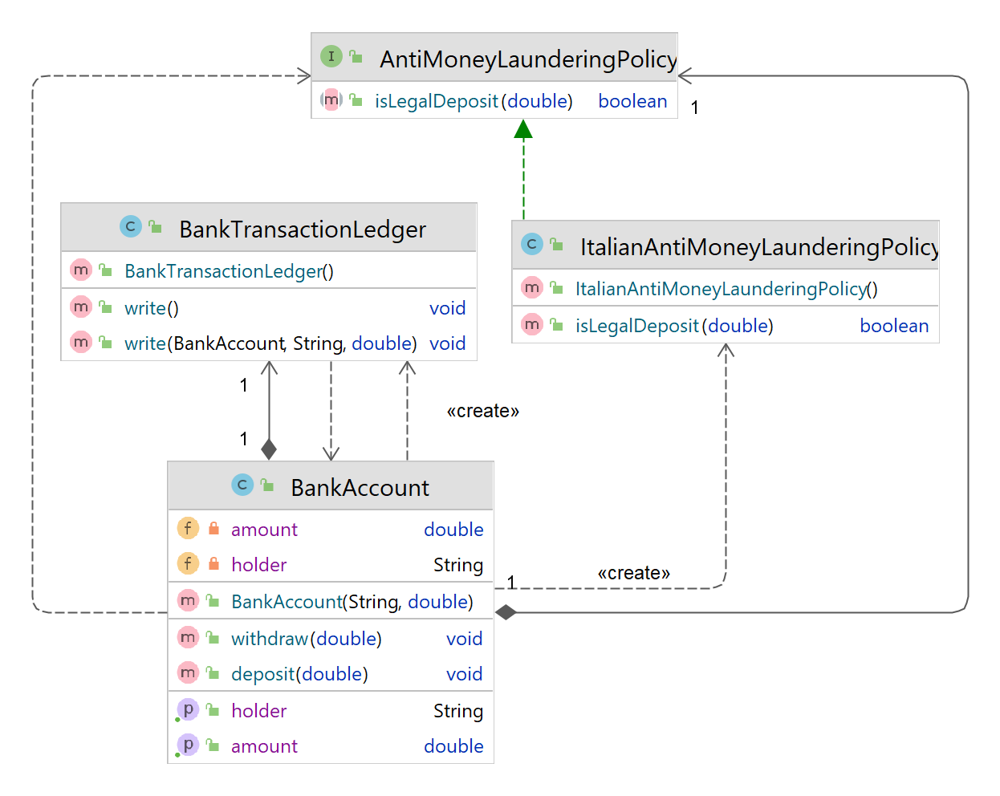

# Assignment: Unit Testing with Hamcrest and Mockito 
 Get your hands dirty with Unit Testing, [Hamcrest](hamcrest.org/JavaHamcrest/) and [Mockito](https://site.mockito.org/).
 Assignment for the students of the Software Project Management and Evolution 
 course at the *Università degli Studi di Napoli Federico II*, Naples, Italy.

This repository contains a Maven project with all required dependencies 
(JUnit 5, Hamcrest, Mockito). I suggest you fork the project, clone your fork and 
work on it, and publish your solution on your forked repo.
Refer to the course materials and to the Hamcrest and Mockito documentation.

# Task 1 
Check out the `it.unina.spme.testing.math.MathUtils` class and its method `getDivisors(int number)` that, 
given a positive integer, returns a List of its divisors. 
For example, `getDivisors(8)= [1,2,4,8]`.

* Check out and run the JUnit 5 test method `testDivisorsOfEight()` for `getDivisors()` provided in the class `MathUtilsTest`.
* Is the provided test a *good* test?
* What happens if the implementation of `getDivisors()` changes and, for example, 
the divisors are returned in decreasing order?
* Rewrite the test to make it more robust (without using Hamcrest).
* Now implement the same test using Hamcrest
* Compare, in terms of readability, the two implementations of the test.

# Task 2
Check out the `it.unina.spme.testing.car.Car` class and its static method `getCars()` 
that returns a List of Car objects.

* Implement each of the test methods provided in `CarTest` using standard JUnit 5
assertions, and then re-implement them using Hamcrest assertions. Some tests require
you to use the custom Matcher `IsPalindrome`, provided in `it.unina.spme.testing`.
* Feel free to refactor the test code (e.g.: use JUnit 5 nested classes, 
  fancy names, setup and teardown methods)
* For at least one of the tests, write your own custom matcher to match only Cars
    satisfying a given condition, and use your custom matcher in the test.

# Task 3
Check out the `it.unina.spme.testing.Bank` package. A class diagram is reported as follows.

A `BankAccount` provides simple methods for withdrawing and depositing money.
Each operation (withdrawal or deposit) must be logged in a highly-critical Bank Ledger, 
which can only contain logs of real bank operations, according to the Banking laws.
Moreover, for a deposit to be valid, its amount must not exceed the threshold 
defined by external regulatory entities in a Anti-money laundering policy
.
Check out the initial tests for the deposit method in the test class `BankAccountTest`.

* Comment on what are, in your opinion, the issues with the provided tests.
* Is `BankAccount` *testable*? Hint: recall the Inversion of Control principle
* Refactor `BankAccount` to make it testable in isolation
* Properly test, using Mockito and Hamcrest, the `withdraw` and `deposit` methods of `BankAccount`, and test its constructor(s) as well.
* Feel free to apply Equivalence Class Partitioning or other techniques to design your test.
Also, make full use of JUnit 5 capabilities (e.g.: parametric tests, nested classes, etc.!)
* Take a few minutes to contemplate how far you've come in writing effective unit tests! 😊 
